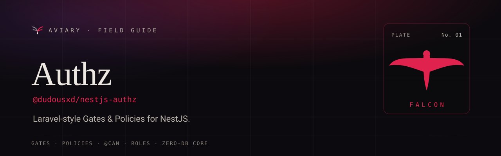

<p align="center">
  <a href="https://davidecarvalho.github.io/aviary/docs/authz">
    
  </a>
</p>

<p align="center">
  <b><a href="https://davidecarvalho.github.io/aviary/docs/authz">📖 Read the documentation</a></b>
  &nbsp;·&nbsp; part of the <a href="https://davidecarvalho.github.io/aviary/"><b>Aviary</b></a> ecosystem for NestJS
</p>

---

# `@dudousxd/nestjs-authz`

NestJS authorization in the Laravel Gate/Policy idiom. **Authorization, not authentication** — it reads the current user (from [`@dudousxd/nestjs-context`](https://github.com/DavideCarvalho/nestjs-context) or passed explicitly) and decides what they may do. Core has **zero database** dependencies; persisted RBAC ships as a separate opt-in adapter.

See [`DESIGN.md`](./DESIGN.md) for the full design.

## Install

```sh
pnpm add @dudousxd/nestjs-authz
```

Peer deps: `@nestjs/common`, `@nestjs/core`, `reflect-metadata`. `@dudousxd/nestjs-context` is an **optional** peer — when present, the gate reads the current user for free; when absent, pass the user explicitly.

## Policies

```ts
import { Policy } from '@dudousxd/nestjs-authz';

@Policy(Post)
export class PostPolicy {
  before(user: User) {
    if (user.isAdmin) return true; // bypass; undefined → falls through
  }
  view(user: User, post: Post) {
    return post.published || post.authorId === user.id;
  }
  update(user: User, post: Post) {
    return post.authorId === user.id;
  }
  create(user: User) {
    return user.verified; // class-level ability (no instance)
  }
}
```

## Module

```ts
AuthzModule.forRoot({
  policies: [PostPolicy], // or rely on @Policy auto-discovery
  superAdmin: (u) => u.isAdmin, // global before-hook
});
```

## Enforcement

Declarative — the `CanGuard` (registered as an `APP_GUARD`) resolves the resource and authorizes:

```ts
@Patch(':id')
@Can('update', Post) // resolves Post by :id, runs PostPolicy.update(currentUser, post)
update(@Param('id') id: string) {}

@Post()
@Can('create', Post, { classLevel: true }) // runs PostPolicy.create(currentUser) — no instance loaded
create() {}
```

Programmatic — inject the `Gate`:

```ts
await this.gate.authorize('update', post); // throws ForbiddenException on deny
if (await this.gate.allows('delete', post)) { /* ... */ }

// explicit user (no nestjs-context required):
await this.gate.forUser(someUser).authorize('update', post);

// ad-hoc gates:
this.gate.define('access-admin', (user) => user.role === 'staff');
await this.gate.allows('access-admin');
```

## Current user

The gate resolves the current user via `@Optional() @Inject(CONTEXT_ACCESSOR)`, matching the well-known token exported by `@dudousxd/nestjs-context`. The accessor is consumed **structurally** (`userRef(): { type, id } | undefined`) — nestjs-context is never imported. If no accessor is present and no user is passed, checks treat the request as unauthenticated and deny.

## Resource resolution

`@Can('update', Post)` needs an instance to pass to the policy. Register a `ResourceResolver` (default: by route `:id`):

```ts
{ provide: RESOURCE_RESOLVER, useClass: MyOrmResourceResolver }
```

## External policy engines (Cerbos, OPA, …)

Register a `DecisionProvider` under `DECISION_PROVIDER` to hand decisions to an external policy
decision point. Unlike the grant-only RBAC seam, it can **allow or deny** a resource-aware check.
Returning `undefined` abstains. The provider can also batch `gate.allowsMany`, and it can map the
engine's query plan onto `gate.scope()`. It runs right after the `superAdmin` hook, which now also
receives the resource. A Cerbos adapter ships in the box as a subpath with no extra dependency;
bring your own `@cerbos/http` or `@cerbos/grpc` client:

```ts
import { DECISION_PROVIDER } from '@dudousxd/nestjs-authz';
import { CerbosDecisionProvider } from '@dudousxd/nestjs-authz/cerbos';
import { HTTP } from '@cerbos/http';

providers: [{
  provide: DECISION_PROVIDER,
  useValue: new CerbosDecisionProvider({
    client: new HTTP(process.env.CERBOS_URL!),            // or (user) => per-tenant client | undefined
    principal: (u) => u && { id: u.id, roles: u.roles, attr: { tenantId: u.tenantId } },
    resource: (ability, r) => (r instanceof Post ? { kind: 'app:post', id: r.id, attr: { ownerId: r.ownerId } } : undefined),
    scope: { resource: (entity) => (entity === Post ? { kind: 'app:post' } : undefined) },
  }),
}]
```

The adapter fails **closed** by default. An unreachable PDP denies, and an unsupported query plan
scopes to no rows. Set `onFailure: 'abstain'` to fall back to your own policies instead.

## License

MIT © Davi Carvalho
